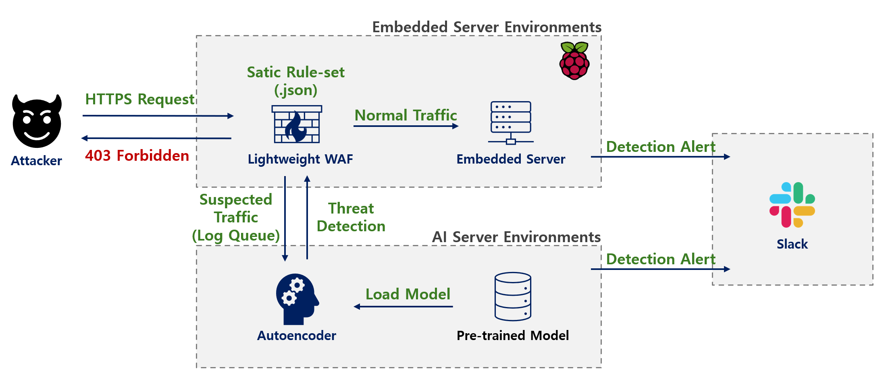

# 🔥 Final: Integrated WAF & AI-Driven Secure Web Server

## 📌 프로젝트 개요
이 모듈은 프로젝트의 최종 완성 단계로, 3_raspberry의 멀티스레드 웹 서버 위에 **C언어 기반의 자체 웹 방화벽(WAF)**, **SQLite3 사용자 인증**, 그리고 **AI 기반 위협 탐지 시스템**을 통합한 버전입니다.  
임베디드 장비가 단순한 웹 서비스 제공을 넘어, 지능형 보안 엣지 디바이스(Intelligent Security Edge Device)로서 기능할 수 있음을 증명하는 데 초점을 맞췄습니다.

---

## 🛠️ 기술적 특징 (System Integration & Security)

### 1️⃣ 하이브리드 보안 아키텍처 (Hybrid Security Architecture)

#### Layer 1: Rule-based WAF (On-Device)
- **C-WAF 엔진**: `rules.json`에 정의된 패턴(SQL Injection, XSS, Path Traversal 등)을 기반으로 요청을 실시간 검사합니다.  
- **Dynamic IP Graylisting**: 공격 탐지 시 `ip_manager.c`가 해당 IP를 즉시 메모리 상의 Graylist에 등록하여 60초간 접속을 차단(HTTP 429 Too Many Requests).  
- **File-based Management**: `ip_whitelist.txt`, `ip_blacklist.txt` 변경 사항을 별도 스레드가 실시간 감지(Hot-Reloading)하여 재시작 없이 정책을 반영합니다.

#### Layer 2: AI Anomaly Detection (Off-loading)
- **Asynchronous Log Shipping**: 메인 웹 서버의 응답 속도 저하를 막기 위해, `logger.c`에서 별도의 스레드(Log Sender Thread)와 메시지 큐(Message Queue)를 운용하여 AI 분석 서버로 로그를 비동기 전송합니다.  
- **Anomaly Detection**: 전송된 로그는 Python 기반의 **Autoencoder 모델**이 분석하며, 알려지지 않은 공격(Zero-day)이나 이상 행위를 탐지합니다.

---

### 2️⃣ 보안 인증 시스템 (Secure Authentication)
- **Embedded DB**: 경량 데이터베이스인 SQLite3를 내장하여 사용자 계정 정보를 관리합니다.  
- **Password Hashing**: 비밀번호는 평문이 아닌 `PBKDF2-HMAC-SHA256` 알고리즘(Iteration: 100,000)을 통해 Salt와 함께 해싱되어 저장되므로, DB 탈취 시에도 크랙이 어렵습니다.

---

### 3️⃣ 실시간 대응 파이프라인 (Real-time Response)
- **Slack Alert**: `log-to-slack.sh` 스크립트가 공격 로그 발생 시 즉시 관리자에게 알림을 전송하여 신속한 대응을 가능하게 합니다.

---

## 🏗️ 시스템 아키텍처 (System Architecture)

```plaintext
[Client]  <-- (TLS 1.3) -->  [ 4_waf_ai_server (C) ]
                                     |
           +-------------------------+-------------------------+
           |                         |                         |
    [1. Rule Checker]         [2. DB Manager]          [3. Logger Thread]
    (Check SQLi/XSS)          (SQLite3 Auth)           (Async SSL Send)
           |                                                   |
           v                                                   v
    [Block or Pass]                                  [ AI Analysis Server (Python) ]
                                                               |
                                                       [ Anomaly Detection ]
                                                               |
                                                       [ Slack Notification ]
```

---

## ⚙️ 빌드 및 실행 방법

### 1️⃣ 필수 패키지 설치
최종 버전은 SQLite3와 AI 서버 구동을 위한 Python 환경이 추가로 필요합니다.
```bash
sudo apt-get install libsqlite3-dev python3-pip
pip install -r ai-server/requirements.txt
```

---

### 2️⃣ 컴파일 (C Web Server)
```bash
make
```
`Makefile`에는 `-lsqlite3`, `-pthread`, `-lcjson`, `-lssl`, `-lcrypto` 등 모든 의존성이 포함되어 있습니다.

---

### 3️⃣ 실행 순서 (중요)

#### Step 1: AI 분석 서버 실행 (Background)
먼저 AI 서버를 띄워 로그 수신 대기 상태로 만듭니다.
```bash
cd ai-server
python3 ai_analyzer.py &
cd ..
```

#### Step 2: Slack 알림 스크립트 실행 (Background)
```bash
chmod +x log-to-slack.sh
./log-to-slack.sh &
```

#### Step 3: 보안 웹 서버 실행
```bash
./webserver
```

---

## 📝 학습 포인트 (Learning Objectives)
- **System Integration**: C언어(웹서버), Python(AI), Shell Script(알림), SQL(DB) 등 이기종 언어와 기술을 하나의 시스템으로 통합하는 능력.  
- **Queue-based Concurrency**: 메인 로직의 블로킹을 방지하기 위해 Producer-Consumer 패턴(로그 큐)을 C언어로 직접 구현하여 동시성 처리 역량 심화.  
- **Database Security**: 임베디드 환경에서의 안전한 데이터 저장 방식(Salted Hash)과 SQL Injection 방어 코딩 실습.  
- **Operational Monitoring**: 파일 감시(`stat`), 로그 테일링(`tail -f`) 등을 활용한 리눅스 기반의 모니터링 시스템 구축.
